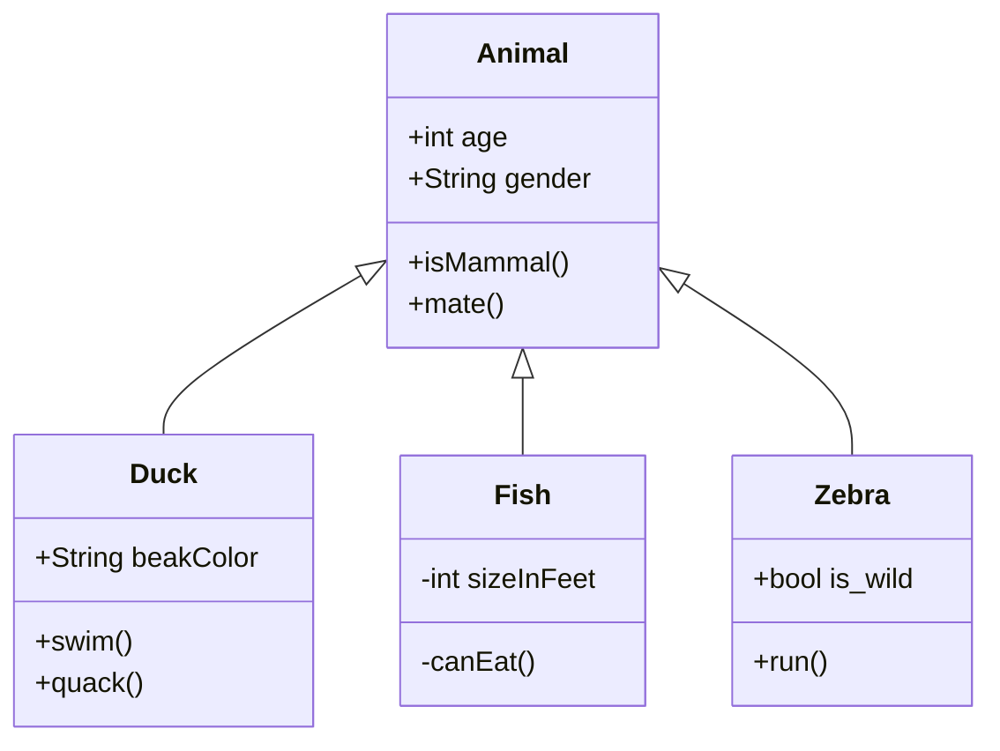
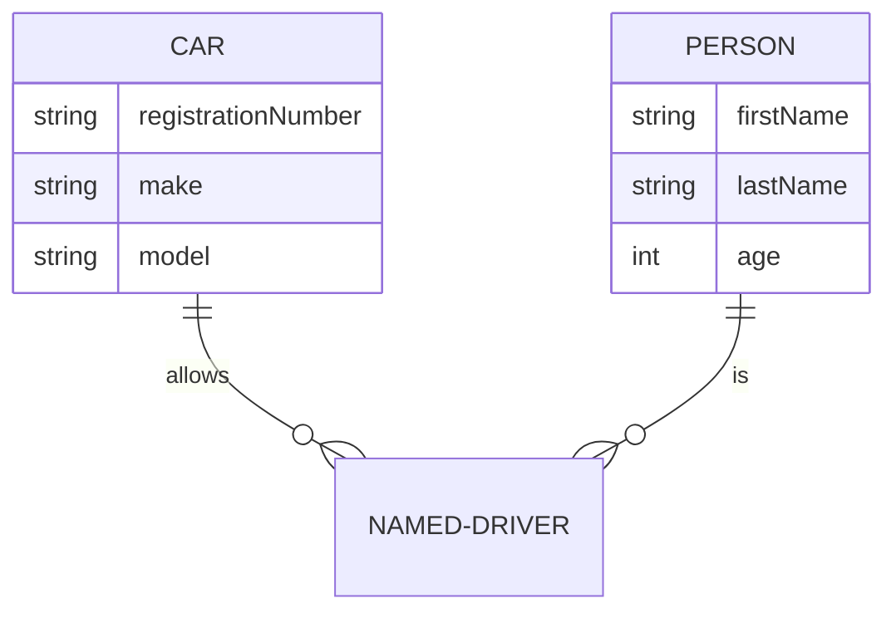

# about-mermaid
[mermaid](https://mermaid.js.org/intro/) is a JavaScript based diagramming and charting tool that uses Markdown-inspired text definitions and a renderer to create and modify complex diagrams. 

---

### Diagram Syntax
#### Class Diagram

---
#### Entity Relationship Diagram

